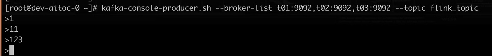
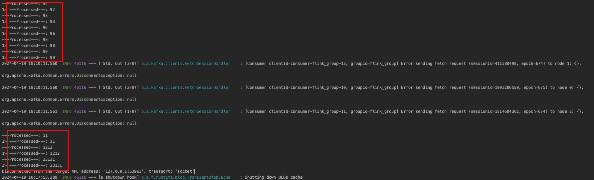

1、IDEA经常缓存似的，明明pom.xml中写的
`
<dependency>
  <groupId>org.apache.flink</groupId>
  <artifactId>flink-connector-kafka_2.11</artifactId>
  <version>1.11.0</version>
</dependency>
`
结果在Extenal Libraries中显示的是flink-connector-kafka_1.17.1，执行mvn clean compile之后都不行，最后点了右侧的Maven插件的文件夹刷新按钮才恢复正常


2、flink的版本最好一一对应
```
    <!-- 添加 Flink 依赖 -->
    <dependency>
      <groupId>org.apache.flink</groupId>
      <artifactId>flink-streaming-java_2.11</artifactId>
      <version>1.11.0</version>
    </dependency>

    <!-- https://mnrepository.com/artifact/org.apache.flink/flink-connector-kafka -->
    <dependency>
      <groupId>org.apache.flink</groupId>
      <artifactId>flink-connector-kafka_2.11</artifactId>
      <version>1.11.0</version>
    </dependency>
    <dependency>
      <groupId>org.apache.flink</groupId>
      <artifactId>flink-clients_2.11</artifactId>
      <version>1.11.0</version>
    </dependency>

```

3、直接在springboot的启动类中添加job的启动
```java
package com.example.flink_demo;

import com.example.flink_demo.flink.FlinkJobService;
import org.springframework.boot.SpringApplication;
import org.springframework.boot.autoconfigure.SpringBootApplication;
import org.springframework.context.ApplicationContext;
import org.springframework.scheduling.annotation.EnableScheduling;

@SpringBootApplication
@EnableScheduling
public class FlinkDemoApplication {

    public static void main(String[] args) throws Exception {
        ApplicationContext context = SpringApplication.run(FlinkDemoApplication.class, args);

        // 获取 FlinkJobService Bean，并运行 Flink 作业
        FlinkJobService flinkJobService = context.getBean(FlinkJobService.class);
        flinkJobService.runFlinkJob();
        flinkJobService.runRealTimeProcessing();
    }

}

```

4、也可以在定时任务中定时启动，但是场景会不一样
注：定时任务中定时执行flink的job，需要使用异步执行，否则会导致内存溢出，是因为因为Spring Boot的@Scheduled注解会在一个新的线程中执行定时任务，而这个新的线程会持有Flink环境的引用，导致Flink环境无法被垃圾回收。
解决这个问题的方法是在定时任务中使用Flink的executeAsync方法异步执行Flink任务。这样可以确保Flink任务在新的线程中执行，而不影响主线程。同时，由于Flink任务在新的线程中执行，所以Flink环境可以被垃圾回收，从而避免了内存占用过高的问题。
参考：https://developer.aliyun.com/article/1469711?spm=5176.26934566.main.9.3de75aa8EvcFsp

以下是一个示例代码：
```java
@Scheduled(fixedRate = 5000)
public void executeFlinkJob() {
   
    ExecutionEnvironment env = ExecutionEnvironment.getExecutionEnvironment();
    // 设置Flink任务的参数
    env.setParallelism(1);
    // 定义Flink任务
    DataSet<String> dataSet = env.readTextFile("path/to/your/file");
    dataSet.filter(value -> value.contains("keyword"))
            .writeAsText("path/to/output/file");
    // 异步执行Flink任务
    env.executeAsync("Flink Job Name");
}
```


3、运行成功之后的截图显示

kafka命令行模拟生产者


console log显示消费者的log


